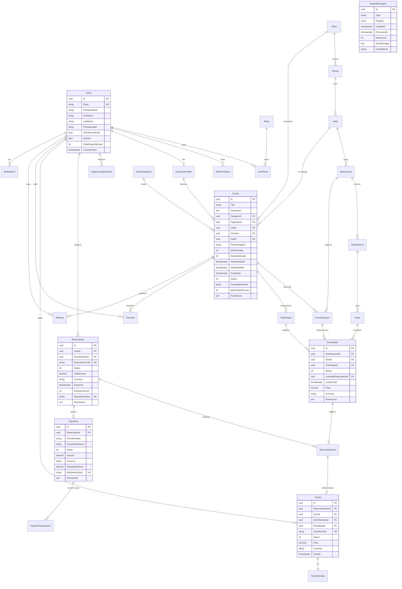

# Sprint 1 — Veritabanı Tasarımı ve ER Diyagramı

PDF'in ER diyagramı bölümünde istenen 28 tablo aşağıda modellenmiştir.

---

## 1. ER Diyagramı



---

## 2. Kritik Tasarım Kararları

### 2.1 Neden `Seats` ve `EventSeats` diye iki ayrı tablo var?

Bu tasarımın en önemli noktası. PDF ikisini de istiyor ama neden ikisinin de
gerektiği açıkça yazmıyor.

- **`Seats`** = fiziksel koltuk. "Kadıköy Sahnesi, Salon A, B bölümü, 5. sıra, 12 numara."
  Salon yıkılmadıkça değişmez. Bir kere oluşturulur.
- **`EventSeats`** = o koltuğun **belirli bir etkinlik oturumundaki** durumu.
  "12 Mart konserinde B-5-12 koltuğu: satılmış, 450 TL, VIP kategorisi."

Eğer tek tablo olsaydı, aynı salonda iki farklı konser olduğunda ikisinin koltuk
durumu birbirine karışırdı. Bir konserde satılan koltuk diğerinde de satılmış
görünürdü.

`EventSeats` her oturum için `Seats` tablosundan **kopyalanarak** üretilir
(`POST /seat-layouts/{id}/generate-seats`). 1000 koltuklu bir salonda 3 oturumlu
etkinlik → 3000 `EventSeat` satırı. Bu kasıtlı bir veri çoğaltmasıdır ve doğrudur:
her satır bağımsız olarak kilitlenebilir olmalı.

### 2.2 `EventSeats` üzerindeki unique index — projenin güvenlik kilidi

```sql
CREATE UNIQUE INDEX ix_event_seats_session_seat
    ON "EventSeats" ("EventSessionId", "SeatId");
```

Bu index, "aynı etkinlik oturumunda aynı koltuk yalnızca bir kez bulunmalıdır"
kuralının (PDF sayfa 8) veritabanı seviyesindeki garantisidir.

Uygulama kodunda ne kadar hata olursa olsun, ne kadar eş zamanlı istek gelirse
gelsin, PostgreSQL aynı oturumda aynı koltuk için ikinci bir satır oluşturmayacaktır.
Yazdığımız C# kodu bir savunma katmanıdır; bu index ise **son** savunma katmanıdır.
İkisi de olmalı.

### 2.3 `RowVersion` neden `uint` ve PostgreSQL'de neye karşılık geliyor?

SQL Server'da `rowversion` diye bir veri tipi vardır. PostgreSQL'de yoktur ama
her tablonun gizli bir `xmin` sistem sütunu vardır — satırı en son değiştiren
transaction'ın ID'sini tutar ve her UPDATE'te otomatik değişir.

EF Core konfigürasyonunda:

```csharp
builder.Property(x => x.RowVersion)
       .HasColumnName("xmin")
       .HasColumnType("xid")
       .ValueGeneratedOnAddOrUpdate()
       .IsConcurrencyToken();
```

Bunu yaptığımda EF Core her UPDATE sorgusuna otomatik olarak
`WHERE Id = @id AND xmin = @okunanDeğer` koşulunu ekler. Ben satırı okuduktan
sonra başka biri onu değiştirmişse `xmin` farklı olur, UPDATE hiçbir satırı
etkilemez ve EF `DbUpdateConcurrencyException` fırlatır. Kaybeden isteğe
409 Conflict döneriz.

Bunun bize maliyeti: **ekstra sütun yok, ekstra index yok.** PostgreSQL zaten
bu bilgiyi tutuyor, biz sadece ondan faydalanıyoruz.

### 2.4 `IdempotencyKey` neden `Reservations` ve `Payments` tablolarında?

PDF Sprint 15: *"Rezervasyon oluşturma, ödeme başlatma, ödeme callback, iade
başlatma"* işlemlerinde idempotency zorunlu.

Senaryo: Kullanıcı "Rezervasyon oluştur" butonuna basıyor, internet yavaş,
sabırsızlanıp ikinci kez basıyor. İki istek de sunucuya ulaşıyor. Idempotency
olmasa iki ayrı rezervasyon oluşur, kullanıcı iki kez ödeme yapar.

Çözüm: Frontend her işlem için bir `Idempotency-Key` üretir (GUID) ve header'da
gönderir. Bu alan veritabanında **unique**'tir. İkinci istek geldiğinde unique
ihlali oluşur, biz bunu yakalar ve ilk isteğin sonucunu döneriz. Yeni kayıt
oluşmaz.

Bunu ayrı bir `IdempotencyKeys` tablosuyla da yapabilirdik ama o zaman
"key kaydet" ve "rezervasyon oluştur" iki ayrı işlem olurdu ve aralarında yine
yarış durumu doğardı. Aynı satırda tutmak, unique constraint'in atomik
garantisinden faydalanmamızı sağlıyor.

### 2.5 Soft delete nerelerde kullanılacak?

| Tablo | Soft delete | Gerekçe |
|---|---|---|
| `Users` | ✓ | Silinen kullanıcının geçmiş biletleri raporlarda kalmalı |
| `Events` | ✓ | Satış yapılmış etkinlik silinemez |
| `SeatLayouts` | ✓ | PDF: "Kullanılmış oturma planı fiziksel olarak silinmemelidir" |
| `Venues`, `Halls` | ✓ | Geçmiş etkinlikler bunlara referans veriyor |
| `TicketTypes` | ✓ | Satılmış biletler bu türe referans veriyor |
| `Reviews` | ✓ | Admin kaldırdığında denetim izi kalmalı |
| `Reservations`, `Payments`, `Tickets` | ✗ | **Asla silinmez.** Durum değişir, kayıt kalır |
| `Notifications`, `AuditLogs`, `OutboxMessages` | ✗ | Arşivlenir, silinmez |

Soft delete'i EF Core global query filter ile uygulayacağız:

```csharp
modelBuilder.Entity<Event>().HasQueryFilter(e => !e.IsDeleted);
```

Bu satırdan sonra `_context.Events.ToListAsync()` yazdığımda EF otomatik olarak
`WHERE "IsDeleted" = false` ekler. Her sorguda elle yazmayı unutma riski ortadan
kalkar. Admin'in silinmişleri de görmesi gerektiğinde `IgnoreQueryFilters()`
kullanacağız.

### 2.6 Para alanlarının tipi

```csharp
builder.Property(x => x.TotalAmount)
       .HasColumnType("numeric(18,2)")
       .IsRequired();

builder.Property(x => x.Currency)
       .HasMaxLength(3)
       .IsRequired();
```

`numeric(18,2)` → 16 basamak tam kısım, 2 basamak kuruş. PostgreSQL'de `numeric`
tam hassasiyetli ondalık tiptir; `real`/`double precision` gibi yuvarlama hatası
yapmaz. `18` sayısı fazlasıyla yeterli (999 trilyon TL).

`Currency` ayrı bir sütun, 3 karakter (ISO 4217: TRY, USD, EUR). Domain'de bu ikisi
birlikte `Money` value object'i oluşturuyor; veritabanında iki sütun olarak
saklıyoruz (EF Core `ComplexProperty` ile eşleyeceğiz).

---

## 3. PDF'in İstediği Unique Kuralları — Karşılıkları

| PDF kuralı | Veritabanı karşılığı |
|---|---|
| Aynı oturumda aynı koltuk bir kez | `UNIQUE (EventSessionId, SeatId)` — EventSeats |
| Bilet numarası benzersiz | `UNIQUE (TicketNumber)` — Tickets |
| QR kod değeri benzersiz | `UNIQUE (QrValue)` — TicketQrCodes |
| Bir kullanıcı bir etkinliği bir kez favoriler | `UNIQUE (UserId, EventId)` — Favorites |
| Bir kullanıcı bir etkinliğe bir yorum | `UNIQUE (UserId, EventId)` — Reviews |
| Aynı salonda aynı isimde iki plan olamaz | `UNIQUE (HallId, Name)` — SeatLayouts |
| Aynı bölümde aynı sıra+koltuk tekrar edemez | `UNIQUE (SeatSectionId, RowNumber, SeatNumber)` — Seats |
| E-posta benzersiz | `UNIQUE (Email)` — Users |

**Not:** Soft delete uygulanan tablolarda unique index'i *partial* yapacağız:

```sql
CREATE UNIQUE INDEX ix_users_email ON "Users" ("Email") WHERE "IsDeleted" = false;
```

Yoksa silinen bir kullanıcının e-postasıyla yeni kayıt açılamazdı — silinmiş satır
hâlâ unique index'te yer tutuyor olurdu.

---

## 4. Cascade Delete Davranışları

| İlişki | Davranış | Gerekçe |
|---|---|---|
| `Reservation` → `ReservationItems` | `Cascade` | Kalem rezervasyonsuz anlamsız |
| `Payment` → `PaymentTransactions` | `Cascade` | Deneme kaydı ödemesiz anlamsız |
| `Ticket` → `TicketQrCode` | `Cascade` | 1-1 ilişki, birlikte yaşar |
| `SeatLayout` → `SeatSections` → `Seats` | `Cascade` | Plan silinirse yapısı da gider |
| `User` → `Reservations` | `Restrict` | Rezervasyonu olan kullanıcı silinemez |
| `Event` → `EventSessions` | `Restrict` | Bilet satılmışsa etkinlik silinemez |
| `EventSession` → `EventSeats` | `Cascade` | Oturum iptal olursa koltuk kayıtları gider |
| `EventSeat` → `ReservationItem` | `Restrict` | Rezerve koltuk silinemez |

Varsayılan olarak EF Core `Cascade` uygular. Bu tehlikelidir: bir kullanıcıyı
silmek istediğimde tüm biletleri, ödemeleri sessizce silinebilir. Bu yüzden
kritik ilişkilerde açıkça `Restrict` yazacağız — silme işlemi hata versin,
sessizce veri kaybetmesin.

---

## 5. Sonraki Adım

Bu tasarım Sprint 2'de şu sırayla koda dönüşecek:

1. 8 projelik solution + katman referansları
2. Domain katmanı: enum'lar, `AuditableEntity`, `Money`, entity'ler
3. Persistence katmanı: `DbContext` + her entity için `IEntityTypeConfiguration`
4. İlk migration + Docker Compose ile PostgreSQL'e uygulama
5. Architecture testleri (katman kuralları)
